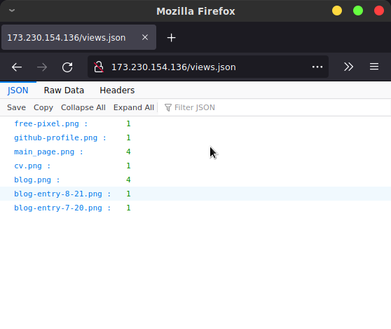

# Quick and Dirty Personal Web Analytics with Tracking Pixels

While working on this blog I decided I need some basic web analytics. I don't want anything 
fancy but I do want a view count and I want to see how much traffic I'm getting on various 
services all in one place. Like most people these days a lot of my public presence I'd like
to track is hosted on various external hosts (ex: github).

tldr: you can grab my full script for quick and dirty web analytics here 

[View Counter](https://gist.github.com/bunnylab/568336d90f4129f5601255629eaa26e0)

## Why not Just Use x

The usual industrial strength solution for web analytics is google analytics or their various competitors. There's a few things that make them innapropriate for my use case: 
- javascript: google analytics embeds are javascript which can't be used when js is disabled 
which is often the case for content hosted on external services like github profiles.
- complexity: way more features than I want and I don't want to spend all day on it
- privacy concerns: google has too much data, let's cut their engineers a break.

## Tracking Pixels

There's an old school technique called [tracking pixels](https://en.wikipedia.org/wiki/Web_beacon) where access to a site or resource can be tracked by embedding an invisible image from an external host you control. The "pixel" is generally 1x1 transparent image like the following.

[tracking pixel for you](http://173.230.154.136/img/free-pixel.png)

## Very Simple Setup for Analytics with Tracking Pixels

There's a number of examples of using tracking pixels with a full web service of some sort. This is more work than I want to put in though. We can acheive the same results with a simple static web server, a script and a cron job. I used the following setup.

- server: nginx server on a cheap hosting provider to serve tracking pixels
- script: python script to parse the nginx access logs and detect any new accesses to my tracking pixels
- cron job: set the script to run every few minutes and update a simple view count

### Server Setup

Set up a new nginx instance if you don't already have one.
Then add a server block to your nginx configuration to handle the tracking pixels like the following. The root route serves the view count and the images route will serve the actual tracking pixels.

```
server {
    access_log /var/log/nginx/tracking.access.log;

    location / {
	root /var/www/tp;
  }

}

```

Place one or more tracking pixels in the /img subdirectory and give them 
unique names. Place an image tag which references your tracking pixels 
onto the sites or services you want to track.

### Script 

[View Counter](https://gist.github.com/bunnylab/568336d90f4129f5601255629eaa26e0)

Full code linked above. This is a fairly simple script which checks for accesses newer than the previous check which match the url pattern for our tracking pixels. eg: "/images/test.png". Create a directory "access-parse" in /usr/local/bin/ and place the script in it.

### CronJob

```
crontab -e
```

open up your cronjobs and add the following line.
```
*/5 * * * * /usr/bin/python3 /usr/local/bin/access-parse/tracking.py >> /usr/local/bin/access-parse/log.cron
```

This will run our tracking script every 5 minutes. Any error messages will be dumped to the log file.

### Embed Tracking Pixels 

Now just place a link like the following in your site, github profile, etc.

```

```

## Enjoy 

And that's all the setup that's required. Go to 'yourserver.com/views.json` 
and enjoy your new high tech web analytics solution.



## Github Profiles and Proxying

Some services like github or gmail will allow you to embed image links but 
will proxy the image request. For example when I load the tracking pixel 
embedded in my github profile my server gets a request like the following.

```
{'ipaddress': '140.82.115.117', 'dateandtime': '24/Feb/2022:22:42:18 +0000', 'url': '/img/github-profile.png ', 'statuscode': '404', 'bytessent': '169', 'refferer': '-', 'useragent': 'github-camo (xxxxx)'}
```

Github camo is githubs image proxying service and is shielding the ip and other personal 
information of the user by replacing our link with their own and scraping the intended 
asset from our site. This stops us from getting information about the direct request but 
we can still get a view count by setting non-caching headers or returning a 404 (easy way 
is just link to a non-existent asset) which forces the proxy to attempt to redownload the 
asset from our server every time someone hits the replaced link.


